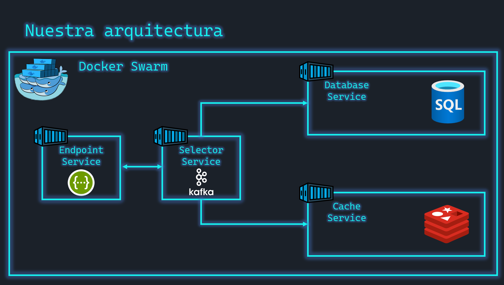

# Proyecto de microservicios

Aquí tienes la arquitectura que vamos a utilizar.



## Arranca todo el proyecto

Clona este repositorio

```bash
git clone https://github.com/aminespinoza10/Live_Microservicios.git
```

Muévete a la carpeta **scripts** y ejecuta el script que se encuentra ahí

```bash
bash createEverything.sh
```

Comprueba que ya tienes una base de datos por utilizar. Puedes leer más al respecto en la documentación de bases de datos [aquí](./docs/database.md)


